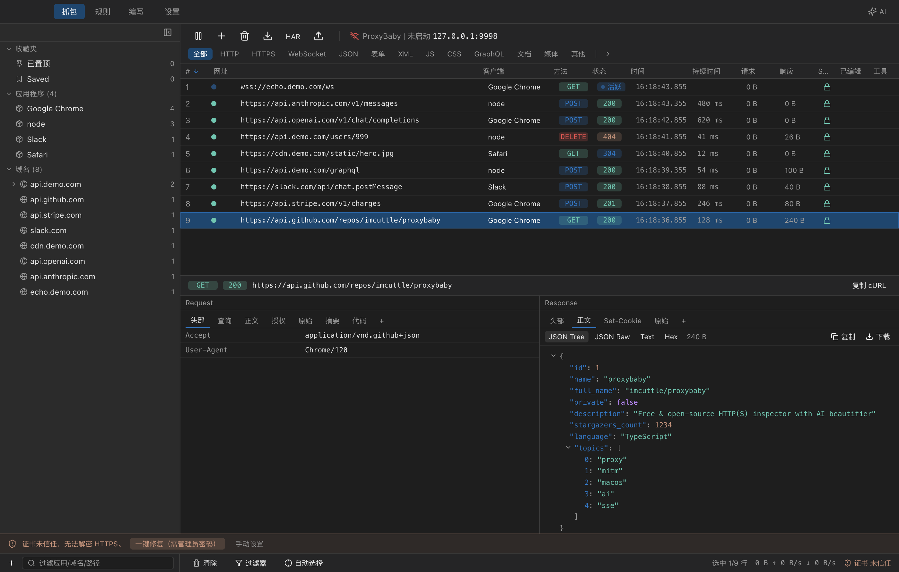
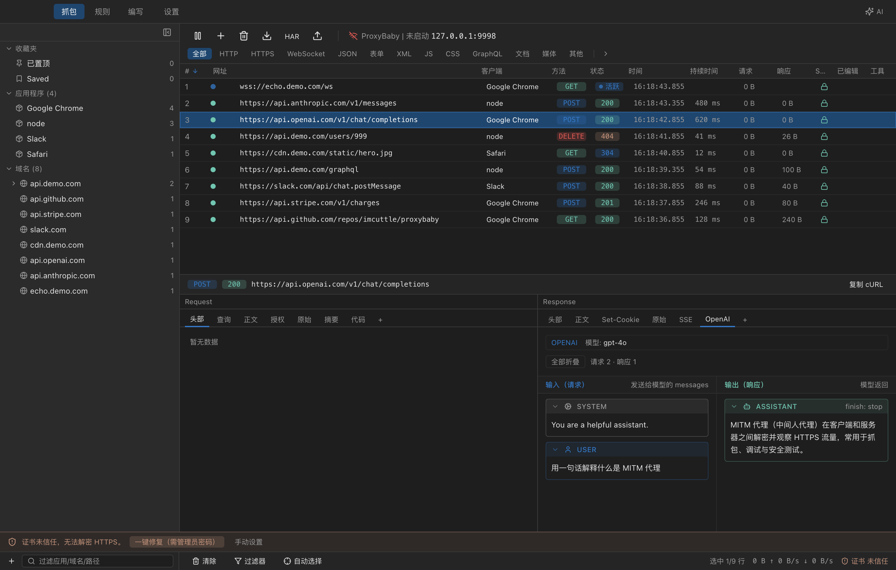
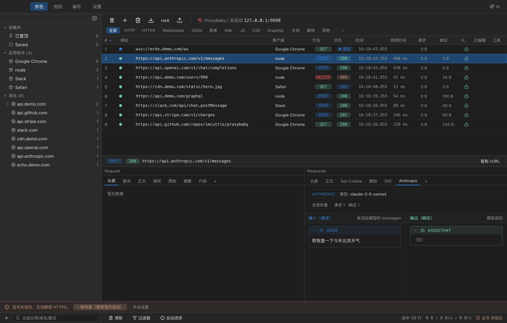
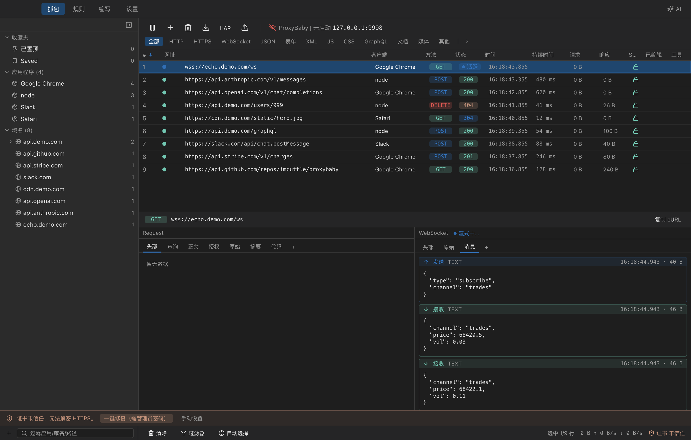
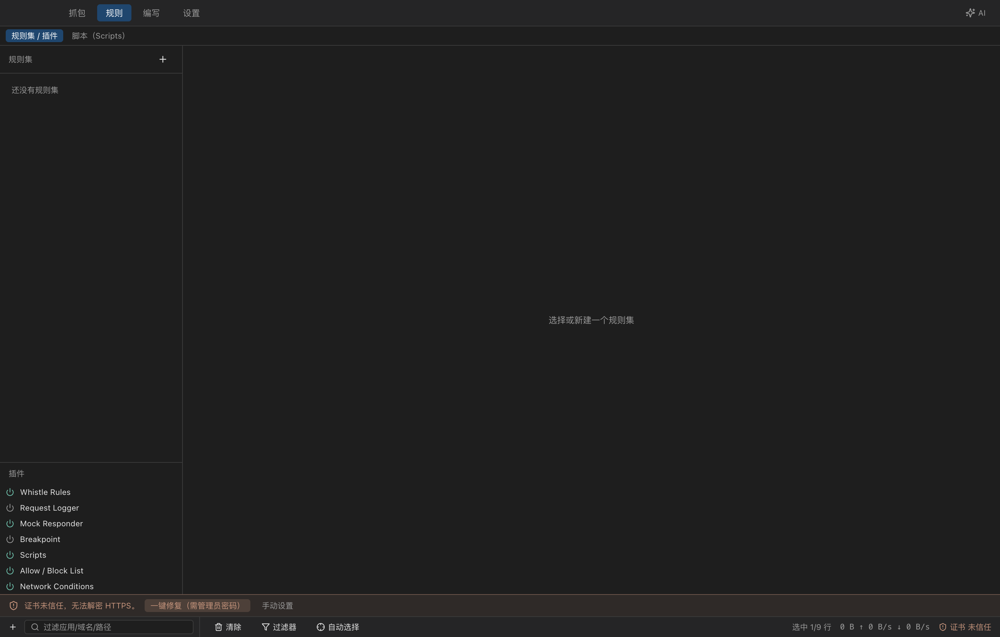

<div align="center">

# 🍼 ProxyBaby

**Free & open-source HTTP(S) proxy debugger for macOS — with a built-in AI / SSE beautifier.**

Zero-config, works out of the box, **every feature free**. On par with Proxyman PRO / Charles / Fiddler / whistle, plus a category-defining **AI conversation viewer** (OpenAI / Anthropic / ACP).

**中文文档 → [README.md](./README.md)**



</div>

---

## Table of contents

[Why](#-why-proxybaby) · [Screenshots](#-screenshots) · [Full feature matrix vs. other proxies](#-full-feature-matrix-vs-other-proxies) · [Full feature list](#-full-feature-list) · [AI-friendly CLI + Skill](#-ai-friendly-full-cli--skill) · [Quick start](#quick-start) · [Tests](#tests--what-they-cover) · [Architecture](#architecture) · [Development](#development)

---

## 🎯 Why ProxyBaby

- **🤖 AI-friendly, first-class** — the only capture tool designed for the AI agent era
  - AI conversations (OpenAI / Anthropic / ACP) rendered as chat bubbles — no more squinting at raw SSE frames
  - A full CLI (`proxybaby`) covering **every** runtime capability: status / proxy / recording / rule CRUD / plugins / session export
  - Built-in AI sidebar: run a `codebuddy --acp` agent right inside the app and let it watch traffic while it edits code
  - Ready-to-use [SKILL.md](skills/proxybaby/SKILL.md) for Claude Code / codebuddy / Cursor
- **Free & open-source** — every feature free. Unlike Proxyman which paywalls breakpoints/mapping/scripting, or Charles which is a 30-day trial
- **whistle-compatible** — 100% whistle rule syntax, migrates whistle users to a real GUI
- **Native macOS** — not Java Swing, not a browser inside Electron; real macOS interactions (Tray, standalone windows, drag & drop)

---

## 📸 Screenshots

<table>
<tr>
<td width="50%">
<b>Capture list + JSON Tree (main)</b><br/>

</td>
<td width="50%">
<b>AI beautifier (OpenAI)</b><br/>

</td>
</tr>
<tr>
<td width="50%">
<b>AI beautifier (Anthropic + tool_use)</b><br/>

</td>
<td width="50%">
<b>WebSocket bidirectional messages</b><br/>

</td>
</tr>
<tr>
<td colspan="2">
<b>whistle rules editor</b><br/>

</td>
</tr>
</table>

> The screenshots above are produced automatically by `tests/e2e/screenshots.e2e.ts` — reproduce with `npx playwright test tests/e2e/screenshots.e2e.ts`.

---

## 🥊 Full feature matrix vs. other proxies

Legend: ✅ supported · ⚠️ partial / paid · ❌ none

| Feature | **ProxyBaby** | Proxyman | Charles | Fiddler Classic | mitmproxy | whistle |
|---|:---:|:---:|:---:|:---:|:---:|:---:|
| Price / License | 🆓 MIT free | 💰 PRO paid | 💰 30-day trial | 🆓 (Win) | 🆓 OSS | 🆓 OSS |
| Platform | macOS | mac / Win / Linux | all | Windows | all (CLI) | all (Web) |
| UI type | native Electron | native | Java Swing | .NET WinForms | terminal / Web | browser |
| Zero-config CA / MITM | ✅ auto-trusted | ✅ | ⚠️ manual | ⚠️ | ⚠️ CLI | ⚠️ |
| System-proxy auto toggle | ✅ on startup, restored on quit | ✅ | ✅ | ⚠️ | ❌ | ❌ |
| Process → app identification | ✅ via `lsof` | ✅ | ❌ | ⚠️ | ❌ | ❌ |
| Sidebar grouping (host / app) | ✅ | ✅ | ⚠️ tree | ⚠️ | ❌ | ⚠️ |
| Real-time streaming list | ✅ | ✅ | ✅ | ✅ | ✅ | ✅ |
| SSE frame-by-frame render | ✅ typewriter effect | ⚠️ raw only | ⚠️ | ⚠️ | ✅ text | ⚠️ |
| **AI beautifier (OpenAI)** | ✅ unique | ❌ | ❌ | ❌ | ❌ | ❌ |
| **AI beautifier (Anthropic tool_use / thinking)** | ✅ unique | ❌ | ❌ | ❌ | ❌ | ❌ |
| **ACP (Agent Client Protocol)** | ✅ unique | ❌ | ❌ | ❌ | ❌ | ❌ |
| WebSocket in/out frames | ✅ | ✅ | ✅ | ⚠️ | ✅ | ⚠️ |
| HTTP/2 | ✅ | ✅ | ✅ | ⚠️ | ✅ | ⚠️ |
| gzip / brotli / deflate auto-decode | ✅ all | ✅ | ✅ | ✅ | ✅ | ✅ |
| JSON Tree viewer | ✅ collapsible + local copy | ✅ | ✅ | ⚠️ | ❌ | ⚠️ |
| Hex / Form / Multipart / GraphQL viewers | ✅ full | ✅ | ✅ | ✅ | ⚠️ | ⚠️ |
| Image / media preview | ✅ | ✅ | ✅ | ⚠️ | ❌ | ⚠️ |
| Response rewrite (headers / body / status) | ✅ | 💰 PRO | ✅ | ✅ | ✅ | ✅ |
| Map Local / File Replace | ✅ `file://` op | 💰 PRO | ✅ | ✅ | ✅ scripts | ✅ |
| Mock / short-circuit responses | ✅ `mock://` | 💰 PRO | ✅ | ✅ | ✅ | ✅ |
| Breakpoint (pause + edit) | ✅ | 💰 PRO | ✅ | ✅ | ✅ | ⚠️ |
| whistle rule syntax | ✅ 100% compatible | ❌ | ❌ | ❌ | ❌ | ✅ native |
| Multi rule-set switching | ✅ persisted to disk | ⚠️ | ⚠️ | ⚠️ | ⚠️ | ✅ |
| Script hook (JS) | ✅ `script://` | 💰 PRO | ⚠️ | ✅ | ✅ Python | ✅ |
| Upstream proxy | ✅ | ✅ | ✅ | ✅ | ✅ | ✅ |
| Throttle 3G/4G/Offline | ✅ | ✅ | ✅ | ⚠️ | ⚠️ | ⚠️ |
| Allow / Block list | ✅ host/glob/regex | 💰 PRO | ✅ | ✅ | ✅ | ✅ |
| SSL fine-grained whitelist | ✅ | ✅ | ✅ | ⚠️ | ✅ | ⚠️ |
| Advanced filters (multi-cond AND + presets) | ✅ | ✅ | ✅ | ⚠️ | ⚠️ | ⚠️ |
| Pin / Save single request | ✅ | ✅ | ⚠️ | ❌ | ❌ | ❌ |
| Diff two requests | ✅ context menu | 💰 PRO | ❌ | ⚠️ | ❌ | ❌ |
| Code gen (cURL/fetch/Python/Go/Java…) | ✅ 10+ langs | ✅ | ⚠️ cURL only | ⚠️ | ❌ | ❌ |
| Composer / manual request | ✅ | ✅ | ✅ | ✅ | ❌ | ⚠️ |
| Custom preview tab | ✅ user-defined | ❌ | ❌ | ✅ plugin | ❌ | ❌ |
| HAR import / export | ✅ standard HAR | ✅ | ✅ | ✅ | ⚠️ | ⚠️ |
| Native session format | ✅ `.proxybaby` | ✅ `.proxymanlogs` | ✅ `.chls` | ✅ `.saz` | ✅ flow | ❌ |
| **CLI covers all capabilities** | ✅ `proxybaby` | ⚠️ | ❌ | ⚠️ | ✅ (it IS a CLI) | ✅ |
| **AI-agent autonomous ops** | ✅ SKILL.md | ❌ | ❌ | ❌ | ⚠️ | ❌ |
| Menu-bar Tray | ✅ | ✅ | ❌ | ❌ | ❌ | ❌ |
| Standalone windows (no modals) | ✅ settings / editor / diff | ⚠️ | ❌ | ❌ | ❌ | ❌ |
| Unit + e2e coverage | ✅ 20+ unit · 5 integration · 50+ e2e | 🚫 closed | 🚫 | 🚫 | ✅ OSS | ✅ OSS |

---

## 📋 Full feature list

### Capture & MITM
- Auto-generated root CA (node-forge), silently installed & trusted in the system keychain
- Dynamic leaf-cert issuance per SNI with LRU cache
- Full HTTPS MITM (incl. HTTP/2 over TLS)
- `CONNECT` tunnels + embedded TLS server
- `Upgrade` to WebSocket, raw frame capture
- SSE (`text/event-stream`) incremental frame parser (cross-chunk / blank-line separated / event & id fields)
- WebSocket frame parser (RFC6455: mask / fragments / control frames)
- gzip / brotli / deflate / chunked auto-decode (async — never blocks the event loop)
- System proxy auto toggle (`networksetup`), restored on quit
- Warns + one-click restore when another app takes over your system proxy
- Process-name resolution (`lsof` port → PID → app, cached)
- Upstream proxy config
- Network throttle: 3G / 4G / DSL / offline
- Allow / Block lists (host / glob / regex, per-app)
- SSL whitelist (decide which domains go through MITM)

### Presentation
- Three-pane layout: sidebar (favorites/apps/hosts+subpath) + list + detail
- TanStack Virtual — tens of thousands of rows stay smooth
- Row states: `pending` / `streaming` / `completed` / `error`, color-coded
- Sidebar tree: group by App, group by Host (expand for subpaths)
- Pin (top) + Save (favorite) with dedicated filter views
- Advanced filters: multi-condition AND, save/load presets
- Text search, type filter bar (HTTP/HTTPS/JSON/XML/JS/CSS/GraphQL/Docs/Media/WebSocket…)
- Detail-pane tabs:
  - Request: Headers / Query / Body / Auth / Raw / Summary / Code
  - Response: Headers / Body / Set-Cookie / Raw / SSE / OpenAI / Anthropic / ACP
- Body viewers: JSON Tree (collapsible, local copy) / JSON Raw / Text / Hex / Form / Multipart / GraphQL / Image / Binary download
- LazyText for large content
- Monaco editor for headers/body (syntax highlighting)
- Copy cURL / copy body / download body
- Status bar: cert status, listening address + system proxy toggle, request count, selection stats, throughput

### AI conversation beautifier (the killer feature)
- **OpenAI** `/v1/chat/completions`: streaming deltas rebuilt into `messages`, tool/function calls supported
- **Anthropic** `/v1/messages`: `content_block_start` / `content_block_delta`, incl. `text` / `tool_use` / `thinking`
- **ACP (Agent Client Protocol)**: over WebSocket / SSE — codebuddy / Cursor compatible
- Role-colored bubbles (system / user / assistant / tool)
- Tool-call visualization (incremental JSON args, result bubble)
- Markdown / code blocks / images
- Typewriter streaming (each new frame appended in place, no full re-render)
- Built-in AI sidebar: run `codebuddy --acp` inside the capture window, Slate.js editor with `kind:id` mention syntax

### Request / response rewriting
- Onion-style middleware chain: pre → upstream → post; `respond()` short-circuits (mock), `abort()` aborts
- 100% [whistle](https://wproxy.org/whistle/)-compatible rule syntax, multiple rule-sets
- 18+ built-in operators:
  - `statusCode://` / `redirect://` / `abort://`
  - `reqHeaders://` / `resHeaders://` / `reqBody://` / `resBody://`
  - `host://` / `file://` / `mock://` / `dust://`
  - `reqDelay://` / `resDelay://`
  - `log://` / `ua://` / `referer://`
  - `script://` (custom JS)
  - `breakpoint://`
- Rules editor (Monaco + syntax highlight + example insertion)
- Multi rule-set CRUD + disk persistence (`userData/rules/*.rules`)
- Plugins: `whistle-rules` / `mock` / `logger` / `breakpoint` / `allow-block` / `ssl-list` / `scripts`

### Breakpoints
- Request breakpoint — pause at pre-stage, edit method/URL/headers/body, resume
- Response breakpoint — pause at post-stage, edit status/headers/body, resume
- Conditions (host / URL matching)

### Sessions
- In-memory FIFO session (bounded)
- Export/Import `.proxybaby` (native)
- Export/Import standard HAR
- Session tab switching

### Productivity
- **Composer**: hand-craft an HTTP request (method / URL / headers / body); "copy to Composer" from any captured flow
- **Code gen**: cURL / fetch / axios / Python `requests` / Python `httpx` / Go / Node http / Java OkHttp / …
- **Diff**: multi-select two flows → right-click → side-by-side diff window
- **Custom preview tabs**: user-defined extra rendering tabs
- Standalone windows: settings, editors, diff all in separate BrowserWindows (no modals stealing focus)

### Integration
- **CLI (`proxybaby`)**: control the running app (record on/off, rule mgmt, plugin toggle, app lifecycle, session export)
- **AI Skill (`skills/proxybaby/SKILL.md`)**: agents can mock, rewrite, hijack autonomously
- **Local control channel**: `127.0.0.1:8898`, token at `~/.proxybaby/cli-token`
- **Menu-bar Tray**: persistent tray icon

### Platform
- macOS (universal, Apple Silicon + Intel)
- Windows / Linux on the roadmap

---

## 🤖 AI-friendly: full CLI + Skill

ProxyBaby is the **only capture tool built for the AI-agent era**. Every UI capability has a matching CLI command, and the CLI ships with a ready-made [`SKILL.md`](skills/proxybaby/SKILL.md) so codebuddy / Claude Code / Cursor / Aider can **operate the app autonomously without reading source**.

### One-line prompt to install the skill

Copy the prompt below into your AI assistant (codebuddy / Claude Code / Cursor …) — it'll install the ProxyBaby skill for you:

```
Please install the ProxyBaby AI Skill for me:
1. Fetch skills/proxybaby/SKILL.md from https://github.com/imcuttle/proxybaby
2. Save it locally:
   - If I'm using codebuddy → ~/.codebuddy/skills/proxybaby/SKILL.md
   - If I'm using Claude Code → ~/.claude/skills/proxybaby/SKILL.md
   - If I'm using Cursor → .cursor/rules/proxybaby.mdc in this project
3. Verify ProxyBaby.app is installed; if not, point me to https://github.com/imcuttle/proxybaby
4. Run `proxybaby status` to confirm the CLI can reach the running app
5. Tell me I can now just say "mock endpoint X" and you'll handle it
```

After that, just say **"mock api.example.com/user to return `{ok:true}`"** — the agent will call `proxybaby rule add` and you're done.

### What agents can do for you

Every operation is a normal shell command — the agent only needs Bash access:

- **Mock an endpoint**: `proxybaby rule add mock-user --text 'api.example.com/user mock://{"id":1,"ok":true}'`
- **Hijack production traffic to local**: `proxybaby rule add local-dev --text 'api.example.com host://127.0.0.1:3000'`
- **Inject auth headers**: `proxybaby rule add force-auth --text '*.internal.com/* reqHeaders://{"Authorization":"Bearer test"}'`
- **Simulate 500 / slow network**: `proxybaby rule add flaky --text 'api.foo.com/pay statusCode://500 resDelay://2000'`
- **Capture & analyze production traffic**: `proxybaby record on` → user acts → `proxybaby session export --har --out /tmp/x.har` → agent reads HAR
- **Debug an AI app itself**: let the agent capture its own OpenAI/Anthropic calls and see the conversation right in the UI

### Full CLI

`proxybaby` covers **every** runtime capability of the app:

```bash
# App lifecycle
proxybaby app open                     # launch app (or bring to front)
proxybaby app quit                     # quit
proxybaby status                       # full JSON status (proxy/cert/rules/plugins)

# System proxy
proxybaby proxy on
proxybaby proxy off

# Recording
proxybaby record on                    # start recording
proxybaby record off                   # pause recording
proxybaby record clear                 # clear all captured flows

# Session export
proxybaby session export               # export as .proxybaby (default ~/proxybaby-session.proxybaby)
proxybaby session export --har         # export as standard HAR
proxybaby session export --har --out /tmp/x.har

# Rule-sets (whistle-compatible syntax)
proxybaby rule list                    # list all rule-sets: ● enabled / ○ disabled
proxybaby rule show <id>               # print rule-set contents
proxybaby rule add <name> --file rules.txt
proxybaby rule add <name> --text 'api.example.com mock://{"ok":true}'
proxybaby rule add <name> --file rules.txt --disabled
proxybaby rule update <id> --name <n> --file <p>
proxybaby rule update <id> --enabled | --disabled
proxybaby rule remove <id>
proxybaby rule enable <id>
proxybaby rule disable <id>

# Plugins
proxybaby plugin list                  # whistle-rules / mock / logger / breakpoint / allow-block / ssl-list / scripts
proxybaby plugin enable <id>
proxybaby plugin disable <id>
```

Run `proxybaby --help` for the full manual.

### Under the hood

- CLI ↔ app talks over **loopback HTTP** `127.0.0.1:8898`
- A bearer token is generated on first launch and written to `~/.proxybaby/cli-token` (`chmod 0600`)
- Every request carries `X-ProxyBaby-Token`; the server only listens on loopback — minimal exposure
- Endpoints live in `electron/control/control-server.ts` — plain REST, `curl` works too

### What's inside SKILL.md

`skills/proxybaby/SKILL.md` is the agent-facing manual, containing:

- **Prerequisites**: app must have been launched once (to generate the token)
- **Command cheatsheet**: every command with an example
- **Rule syntax**: whistle-compatible subset + 18+ operators
- **8 fully-worked task examples**
- **Output formats**: which commands return JSON (usable with `jq`)
- **Boundaries & safety**: token protection, macOS dependency, first-run admin prompt

---

## Quick start

Requires Node 18+ and macOS.

```bash
git clone https://github.com/imcuttle/proxybaby.git
cd proxybaby
npm install
npm run dev             # dev mode (vite + electron, HMR)
# or pack & install to /Applications:
npm run install:mac

# Make the CLI globally available:
npm link                # then `proxybaby` works from anywhere
```

First launch prompts once for your admin password to trust the generated root CA in the system keychain. After that, silent.

---

## Tests & what they cover

Three test layers, all using proper frameworks (Vitest + Playwright):

### Unit — `tests/unit/`

| File | Covers |
|------|--------|
| `sse-parser.test.ts` | Incremental SSE frames (cross-chunk / blank-line / event & id) |
| `ws-parser.test.ts`  | WebSocket frames (RFC6455 mask / fragments / control frames) |
| `parsers.test.ts`    | OpenAI / Anthropic / ACP → unified `ChatSession` + `detectProvider` |
| `ai-md-slate.test.ts` | Markdown ↔ Slate.js bidirectional serialization for AI messages |
| `ai-acp-client.test.ts` | ACP client (disable-spawn handshake / routing) |
| `ai-manager.test.ts` | AI sidebar session index CRUD |
| `rule-parser.test.ts` | whistle rule tokenizer (JSON with spaces / quoted values) |
| `operators.test.ts`   | 18+ operator middlewares: statusCode / redirect / reqHeaders / resHeaders / body / mock / delay / log / ua / referer |
| `body-detect.test.ts` | Body-type detection + form-urlencoded / multipart / GraphQL / hexdump |
| `filter.test.ts` + `filter-entry.test.ts` | Main filter + entry matching (host / app / glob / regex) |
| `code-gen.test.ts`    | cURL / fetch / axios / Python / Go / Node / Java code generation |
| `session-io.test.ts`  | `.proxybaby` + HAR export/import |
| `diff.test.ts`        | Line-level diff algorithm |
| `network-conditions.test.ts` | 3G / 4G / offline throttling |
| `ssl-list.test.ts`    | SSL decrypt whitelist/blacklist |

### Integration — `tests/integration/` (real ports)

- `proxy.test.ts` — real target server + `ProxyServer`: HTTP/HTTPS MITM, SSE streaming, WS frames
- `content-types.test.ts` — content-types & encodings (gzip / br / deflate / chunked / JSON / form / multipart / image)
- `whistle-rules.test.ts` — rule CRUD persistence + end-to-end through the proxy
- `allow-block.test.ts` — allow / block plugin
- `scripts.test.ts` — `script://` operator

### E2E — `tests/e2e/` (Playwright + Electron)

`_electron.launch` boots the packaged app; `PROXYBABY_E2E=1` opens the `__pbE2E.emit` injection channel, feeds synthesized flows into the real UI, then asserts UI behavior.

- `app.e2e.ts` (40+ cases): main window / injected flows / SSE tab / WebSocket / OpenAI streaming → chat bubbles / sidebar grouping / rules CRUD / plugin toggles / status bar / JSON Tree Raw / cURL copy / listener popover / capture↔rules switching / text/type/app/subpath/pin/save filters / Form/Hex/Image bodies / code-gen per language / filter presets / Allow/Block/SSL windows / scripts editor / network conditions / upstream / Composer / Diff / custom preview tabs / system-proxy-overridden warning
- `ai-chat.e2e.ts`: AI sidebar visibility / create/switch/delete sessions / mention chips / streaming text-deltas / images / attachments / overflow dropdown / sidebar collapse
- `screenshots.e2e.ts`: auto-generates README screenshots

Run them:

```bash
npm test                  # unit + integration
npm run test:unit
npm run test:integration
npm run test:e2e          # auto-builds via vite before Playwright
npm run test:all
```

Single case:

```bash
npx vitest run tests/unit/parsers.test.ts -t 'OpenAI parsing'
npx playwright test tests/e2e --grep 'text search'
```

---

## Architecture

Main process (`electron/`) does capture + system integration; renderer (`src/`) does UI; they talk via the preload bridge `window.proxybaby` + event pushes. Shared types live in `shared/types.ts`.

```
proxybaby/
├─ electron/                # main process
│  ├─ main.ts               # entry, lifecycle, tray
│  ├─ preload.ts            # context bridge (built to preload.cjs)
│  ├─ proxy/                # proxy engine + SSE / WS parsers
│  ├─ engine/               # rule parser / operators / middleware / plugins / breakpoint
│  ├─ mitm/                 # root CA + leaf cert + trust install
│  ├─ system/               # system proxy + lsof process lookup
│  ├─ store/                # in-memory flow store + session IO
│  └─ control/              # local control HTTP server (CLI + AI skill)
├─ src/                     # renderer
│  ├─ App.tsx
│  ├─ components/           # UI + tabs (Headers/Body/SSE/WS/Chat)
│  ├─ parsers/              # OpenAI / Anthropic / ACP adapters (pure & idempotent)
│  └─ store/                # zustand
├─ shared/                  # main <-> renderer shared types
├─ skills/proxybaby/        # AI skill definition
├─ bin/proxybaby.cjs        # CLI
└─ tests/                   # unit / integration / e2e
```

**Capture data-flow**: `onRequest` builds Flow → `flow:start` → read request body → onion middleware (rules / breakpoint / mock) → `forwardUpstream` → `flow:response-headers` → non-SSE buffer & async decompress / SSE per-frame `flow:sse-frame` → `flow:response-body` + `flow:end`; every step writes to FlowStore and broadcasts to the renderer.

---

## Development

```bash
npm install
npm run dev              # vite + electron (HMR)
npm run typecheck        # tsc --noEmit (must pass after any change)
npm run build            # dmg + zip
npm run build:dir        # unpacked .app only (faster)
npm run install:mac      # build:dir → install to /Applications
```

### Constraints worth knowing

- All main-process IO must be async (no `*Sync`) — otherwise the proxy and UI freeze
- preload is CommonJS (sandboxed preload doesn't support ESM); bundled to `preload.cjs`
- IPC payloads must be structured-clonable (no functions, no RegExp)
- Response `bodyBuffer` keeps the original (possibly compressed) bytes for downstream write-back; `bodyText` is decompressed only for display
- E2E env var `PROXYBABY_E2E=1` skips cert install / system proxy and opens the `__pbE2E.emit` channel

See [`CODEBUDDY.md`](./CODEBUDDY.md) for more.

---

## Release process

Uses [changesets](https://github.com/changesets/changesets) + GitHub Actions.
**A release is only published when you explicitly run `npm run release` locally** — pushing to `main` does NOT auto-publish.

```bash
# 1. Write a changeset for your change (asks major/minor/patch + description)
npx changeset

# 2. Push the changeset file to main
git add .changeset && git commit -m "docs: changeset for xxx" && git push

# 3. When you're ready to ship (you can batch multiple changesets)
npm run release
#    ↑ locally: apply changesets → bump package.json → update CHANGELOG.md
#              → commit → push main → tag vX.Y.Z → push tag
#    Once the tag hits GitHub, Actions builds dmg/zip and creates the Release.
```

Two workflows:

- `.github/workflows/ci.yml` — runs typecheck + unit + integration on every push/PR
- `.github/workflows/release.yml` — only triggered by a `v*` tag or manual `workflow_dispatch`; builds unsigned DMG/zip on `macos-latest` and calls `gh release create`

---

## Roadmap

- Windows / Linux
- iOS / Android device cert installer
- Deeper WebSocket beautification (protocol detection, Protobuf decoding)
- More AI protocols (Google Gemini, Cohere, Mistral, OpenRouter…)
- Cloud rule-set sync

---

## License

MIT © [imcuttle](https://github.com/imcuttle)

If ProxyBaby helps you, please ⭐ the repo — it really helps.
